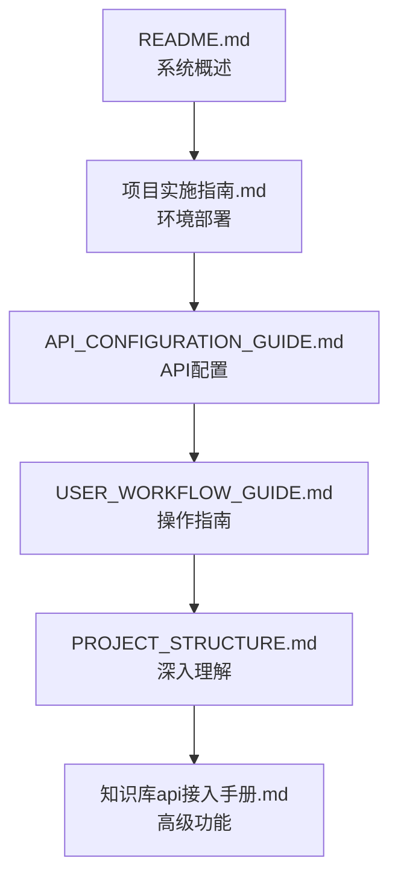

# 📚 文档导航

欢迎使用邮件知识库处理系统文档中心！本目录包含系统的完整文档，帮助您快速上手和深入使用。

## 📋 文档目录

### 🏗️ 系统架构文档
- **[PROJECT_STRUCTURE.md](./PROJECT_STRUCTURE.md)** - 项目结构和架构说明
  - 目录结构详解
  - 模块功能说明  
  - 数据流程图
  - 配置系统介绍
  - 扩展性设计

### 🛠️ 实施和配置文档
- **[项目实施指南.md](./项目实施指南.md)** - 项目部署和实施指导
  - 环境准备
  - 部署步骤
  - 配置要求
  - 测试验证

- **[API_CONFIGURATION_GUIDE.md](./API_CONFIGURATION_GUIDE.md)** - API Key配置详细指南
  - 多编号API Key配置
  - 安全管理最佳实践
  - 故障排除指南
  - 性能优化建议

### 📖 使用指南文档
- **[USER_WORKFLOW_GUIDE.md](./USER_WORKFLOW_GUIDE.md)** - 完整工作流程指南
  - 6个步骤详细操作
  - 最佳实践建议
  - 常见问题解决
  - 质量控制方法

### 🔗 API接入文档
- **[知识库api接入手册.md](./知识库api接入手册.md)** - GPTBots API详细使用说明
  - API接口详细说明
  - 请求参数和响应格式
  - 错误码和处理方法
  - 使用示例和最佳实践

## 🚀 快速导航

### 新用户入门
1. 📖 先阅读 **[../README.md](../README.md)** 了解系统概述
2. 🛠️ 参考 **[项目实施指南.md](./项目实施指南.md)** 进行部署
3. 🔑 按照 **[API_CONFIGURATION_GUIDE.md](./API_CONFIGURATION_GUIDE.md)** 配置API Key
4. 📋 跟随 **[USER_WORKFLOW_GUIDE.md](./USER_WORKFLOW_GUIDE.md)** 完成首次处理

### 系统管理员
1. 🏗️ 查看 **[PROJECT_STRUCTURE.md](./PROJECT_STRUCTURE.md)** 了解系统架构
2. ⚙️ 参考 **[API_CONFIGURATION_GUIDE.md](./API_CONFIGURATION_GUIDE.md)** 进行高级配置
3. 🔧 使用 **[知识库api接入手册.md](./知识库api接入手册.md)** 进行API集成

### 开发者
1. 📁 参考 **[PROJECT_STRUCTURE.md](./PROJECT_STRUCTURE.md)** 了解代码组织
2. 🔗 查看 **[知识库api接入手册.md](./知识库api接入手册.md)** 了解API接口
3. 🛠️ 按照开发规范进行功能扩展

## 📊 文档使用统计

| 文档类型 | 文档数量 | 主要用途 |
|---------|---------|----------|
| 架构文档 | 1 | 系统理解和维护 |
| 配置文档 | 2 | 部署和配置 |
| 使用文档 | 1 | 日常操作指导 |
| API文档 | 1 | 开发和集成 |

## 🔄 文档更新

### 版本历史
- **v2.0** (2024-09-04): 完整功能版本，新增问答系统
- **v1.5** (2024-09-03): 添加知识库管理功能
- **v1.0** (2024-09-01): 初始版本，基础邮件处理功能

### 维护说明
- 文档与代码同步更新
- 重要变更会在README中说明
- 建议定期查看最新版本

## 💡 使用建议

### 阅读顺序

### 文档标记说明
- 📚 **必读文档**: 所有用户都应该阅读
- 🔧 **配置文档**: 系统管理员重点关注  
- 👨‍💻 **开发文档**: 开发者和高级用户参考
- ⚠️ **重要提示**: 关键信息和注意事项

## 🆘 获取帮助

### 文档反馈
如果您在使用文档过程中遇到问题：
1. 检查是否阅读了相关的前置文档
2. 查看文档中的故障排除部分
3. 参考系统日志获取详细错误信息
4. 联系技术支持团队

### 文档改进建议
我们欢迎您的反馈和建议：
- 文档内容不清晰的地方
- 缺失的使用场景说明
- 需要补充的技术细节
- 格式和结构改进建议

---

*最后更新: 2024年9月4日*
*文档维护: 邮件知识库处理系统开发团队*
