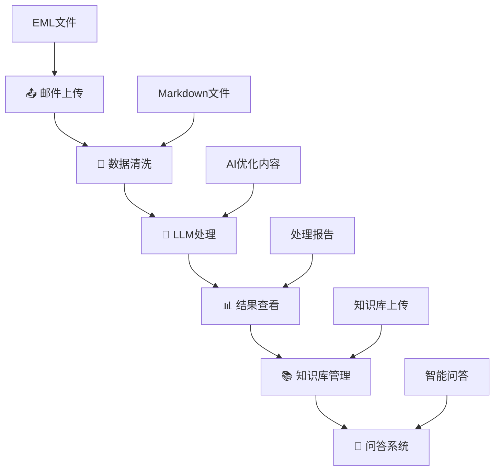
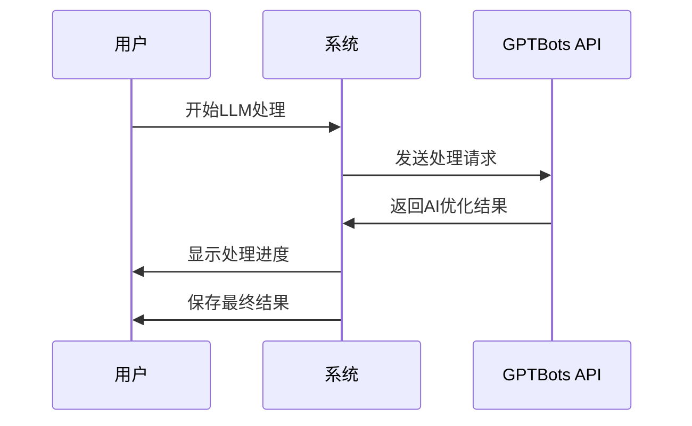
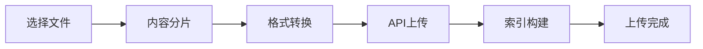

# 📖 用户工作流程指南

## 🎯 概述

本指南详细介绍邮件知识库处理系统的完整工作流程，帮助用户高效地从邮件上传到智能问答的全过程操作。

## 🔄 完整工作流程



---

## 📤 步骤1: 邮件上传

### 🎯 目标
将原始EML格式邮件文件上传到系统进行后续处理。

### 📋 准备工作
- 确保邮件文件为`.eml`格式
- 检查文件大小（单文件≤50MB）
- 准备批量文件（建议≤200个文件）

### 🔧 操作步骤

#### 1.1 访问上传页面
1. 启动应用后访问首页
2. 点击侧边栏"📤 邮件上传"
3. 查看当前上传目录状态

#### 1.2 选择文件
```
支持的操作：
✅ 单文件上传
✅ 多文件批量选择  
✅ 拖拽上传
✅ 文件格式验证
```

#### 1.3 执行上传
1. 点击"选择文件"或拖拽文件到上传区域
2. 系统自动验证文件格式和大小
3. 显示上传进度和结果
4. 查看上传成功的文件列表

#### 1.4 验证结果
- 检查上传文件数量
- 确认文件完整性
- 查看错误报告（如有）

### ⚠️ 注意事项
- 文件名不能包含特殊字符
- 确保网络连接稳定
- 大文件上传可能需要较长时间

### 📊 成功指标
- 所有文件上传成功
- 无格式错误提示
- 文件列表显示完整

---

## 🧹 步骤2: 数据清洗

### 🎯 目标
将上传的EML文件转换为结构化的Markdown格式，提取有用信息。

### 📋 准备工作
- 确认步骤1已完成
- 检查上传文件数量
- 了解清洗规则和输出格式

### 🔧 操作步骤

#### 2.1 启动清洗
1. 访问"🧹 数据清洗"页面
2. 查看待处理文件统计
3. 点击"开始清洗"按钮

#### 2.2 监控进度
```
清洗过程显示：
📊 处理进度条
📈 实时统计信息
📝 处理日志
⚠️ 错误提示
```

#### 2.3 清洗规则
系统自动执行以下清洗操作：
- 提取邮件头信息（发件人、收件人、主题、时间）
- 移除HTML标签和样式
- 转换为Markdown格式
- 清理特殊字符和编码
- 提取附件信息

#### 2.4 查看结果
1. 等待清洗完成
2. 查看处理统计报告
3. 检查输出文件质量
4. 处理错误文件（如有）

### 📄 输出格式
```markdown
# 邮件标题
**发件人**: sender@example.com
**收件人**: recipient@example.com  
**时间**: 2024-01-01 10:00:00

## 邮件内容
清洗后的邮件正文内容...

## 附件信息
- attachment1.pdf
- attachment2.docx
```

### 🔍 质量检查
- 检查Markdown格式正确性
- 验证中文编码无乱码
- 确认关键信息完整性

---

## 🤖 步骤3: LLM处理

### 🎯 目标
使用AI对清洗后的内容进行智能优化和结构化处理。

### 📋 准备工作
- 确认步骤2已完成
- 配置LLM API Key
- 选择处理参数

### 🔧 操作步骤

#### 3.1 API配置
1. 访问"🤖 LLM处理"页面
2. 选择API节点（推荐新加坡）
3. 从下拉框选择LLM API Key
4. 点击"测试API连接"验证配置

#### 3.2 处理参数设置
```
可配置参数：
⏱️ 延迟时间: 1-10秒（避免API限流）
🔄 批处理: 最大200文件
🎯 处理模式: 智能优化/结构化/摘要提取
```

#### 3.3 开始处理
1. 点击"开始LLM处理"
2. 监控实时进度
3. 查看处理日志
4. 等待批量处理完成

#### 3.4 处理流程


### 🎨 AI优化功能
- **内容结构化**: 自动组织信息层次
- **语言优化**: 提升表达质量和可读性
- **关键信息提取**: 识别重要信息点
- **格式标准化**: 统一输出格式
- **摘要生成**: 生成内容摘要

### 📊 处理监控
- 实时进度显示
- 成功/失败统计
- 错误日志记录
- 处理时间统计

---

## 📊 步骤4: 结果查看

### 🎯 目标
查看和管理各阶段的处理结果，进行质量评估。

### 🔧 操作步骤

#### 4.1 结果概览
1. 访问"📊 结果查看"页面
2. 查看处理统计信息
3. 了解各阶段文件数量

#### 4.2 文件浏览
```
支持的操作：
👀 在线预览
📥 单文件下载  
📦 批量打包下载
🔍 内容搜索
```

#### 4.3 质量评估
- 检查AI处理质量
- 验证内容完整性
- 识别需要手动调整的内容
- 标记问题文件

#### 4.4 导出功能
1. 选择要导出的文件
2. 选择导出格式（Markdown/PDF/Word）
3. 生成压缩包
4. 下载到本地

### 📈 统计信息
- 总处理文件数
- 成功率统计
- 处理时间分析
- 文件大小统计
- 错误类型分布

---

## 📚 步骤5: 知识库管理

### 🎯 目标
将AI处理后的内容上传到GPTBots知识库，为问答系统提供数据源。

### 📋 准备工作
- 确认步骤3已完成
- 配置知识库API Key
- 获取目标知识库ID

### 🔧 操作步骤

#### 5.1 知识库配置
1. 访问"📚 知识库管理"页面
2. 选择知识库API Key
3. 点击"获取知识库列表"
4. 从列表中选择目标知识库

#### 5.2 上传配置
```
配置参数：
📝 分片大小: 600 tokens（推荐）
📊 上传格式: Markdown
🔄 批处理模式: 并发上传
⚠️ 错误处理: 自动重试
```

#### 5.3 执行上传
1. 确认文件列表和数量
2. 点击"开始上传到知识库"
3. 监控上传进度
4. 查看上传结果报告

#### 5.4 上传流程


### 📊 上传监控
- 实时上传进度
- 成功/失败统计
- 分片处理状态
- 错误重试机制

### ✅ 验证上传
- 检查知识库文档数量
- 验证内容索引正确性
- 测试知识检索功能

---

## 💬 步骤6: 问答系统

### 🎯 目标
基于上传的知识库内容，提供智能问答服务。

### 📋 准备工作
- 确认步骤5已完成
- 配置问答API Key
- 了解问答功能特性

### 🔧 操作步骤

#### 6.1 问答配置
1. 访问"💬 问答系统"页面
2. 选择API Key来源：
   - 问答专用API Key
   - 知识库API Key（复用）
   - 手动输入API Key
3. 选择API节点

#### 6.2 问答模式选择
```
🤖 直接问答:
- iframe嵌入式界面
- 语音输入支持
- 实时对话体验

💬 交互式问答:
- 基于API的问答
- 历史记录管理
- 自定义问题

🖼️ iframe嵌入代码:
- 生成嵌入代码
- 自定义样式配置
- 第三方网站集成

🔧 API接口测试:
- 连接状态测试
- 功能验证
- 性能测试
```

#### 6.3 开始问答
1. 选择问答模式
2. 输入问题或使用语音输入
3. 查看AI回答
4. 进行多轮对话

#### 6.4 问答特性
- **上下文理解**: 支持多轮对话
- **知识检索**: 基于上传的邮件内容
- **智能回答**: AI生成准确回答
- **语音交互**: 支持语音输入和输出
- **历史记录**: 保存对话历史

### 🎨 高级功能
- **问题建议**: 系统推荐相关问题
- **答案评分**: 用户反馈答案质量
- **知识导航**: 引导深入了解
- **多语言支持**: 支持中英文问答

---

## 🔄 工作流程最佳实践

### 📊 批量处理策略
```
小批量（<50文件）:
- 适合测试和验证
- 快速反馈和调整
- 实时监控处理质量

中批量（50-150文件）:
- 平衡效率和质量
- 分阶段处理验证
- 适合日常处理任务

大批量（150-200文件）:
- 最大化处理效率
- 需要充足API配额
- 建议分时段处理
```

### ⏰ 时间规划
- **邮件上传**: 5-15分钟（取决于文件数量）
- **数据清洗**: 10-30分钟（取决于邮件复杂度）
- **LLM处理**: 30-120分钟（取决于API速度）
- **结果查看**: 10-20分钟（质量检查）
- **知识库上传**: 15-45分钟（取决于内容量）
- **问答测试**: 5-10分钟（功能验证）

### 🔍 质量控制
1. **每步验证**: 完成一步后检查结果质量
2. **抽样检查**: 大批量处理时抽样验证
3. **错误处理**: 及时处理失败文件
4. **备份策略**: 重要数据多重备份

### 📈 性能优化
- **API Key轮换**: 使用多个API Key提高并发
- **节点选择**: 选择延迟最低的API节点
- **批次调整**: 根据系统性能调整批次大小
- **时间分散**: 避开API高峰时段

---

## ⚠️ 常见问题解决

### 处理中断
**问题**: 处理过程中系统中断
**解决方案**:
1. 重新启动应用
2. 检查已处理文件
3. 从中断点继续处理
4. 查看错误日志分析原因

### 质量问题
**问题**: AI处理结果质量不理想
**解决方案**:
1. 调整处理参数
2. 优化输入内容质量
3. 尝试不同的API Key
4. 手动后处理调整

### 上传失败
**问题**: 知识库上传失败
**解决方案**:
1. 检查API Key权限
2. 验证知识库状态
3. 调整分片大小
4. 重试失败的文件

### 问答异常
**问题**: 问答系统响应异常
**解决方案**:
1. 检查知识库内容
2. 验证API连接
3. 调整问题表达方式
4. 查看API调用日志

---

## 📞 技术支持

### 自助诊断
1. 查看相关日志文件
2. 检查配置参数
3. 验证API连接状态
4. 参考故障排除指南

### 联系支持
- 提供详细错误信息
- 附上相关日志文件
- 说明操作步骤和环境
- 描述期望结果

---

*最后更新: 2024年9月4日*
